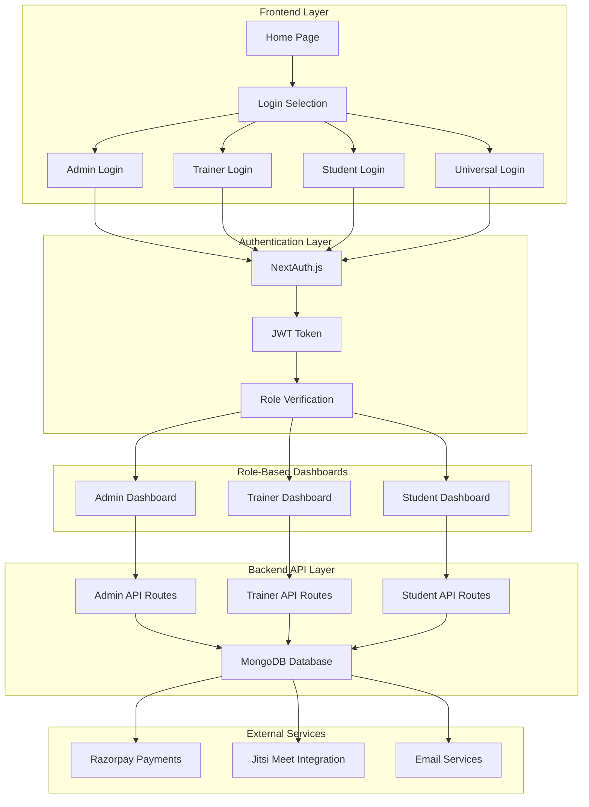
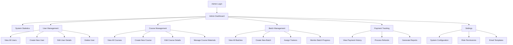
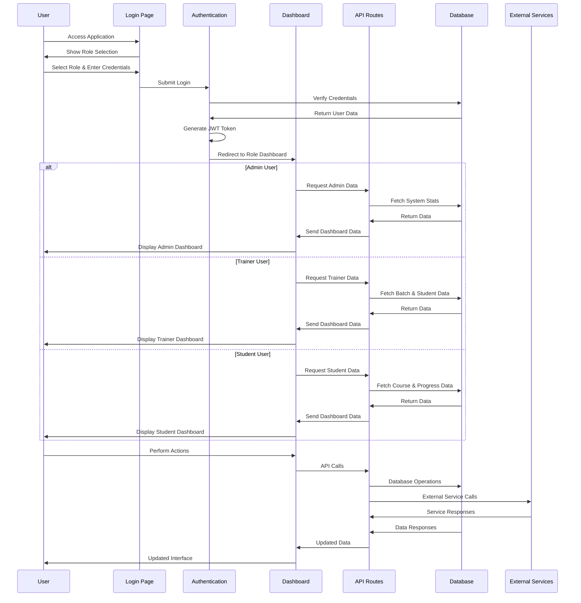
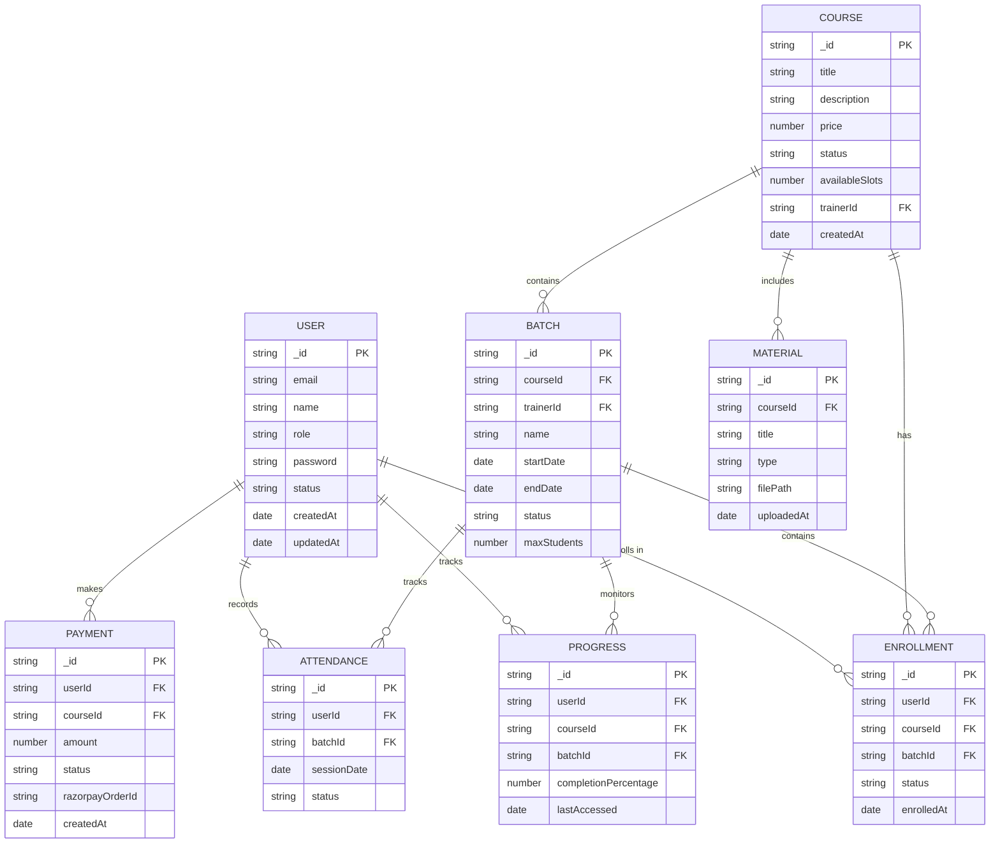
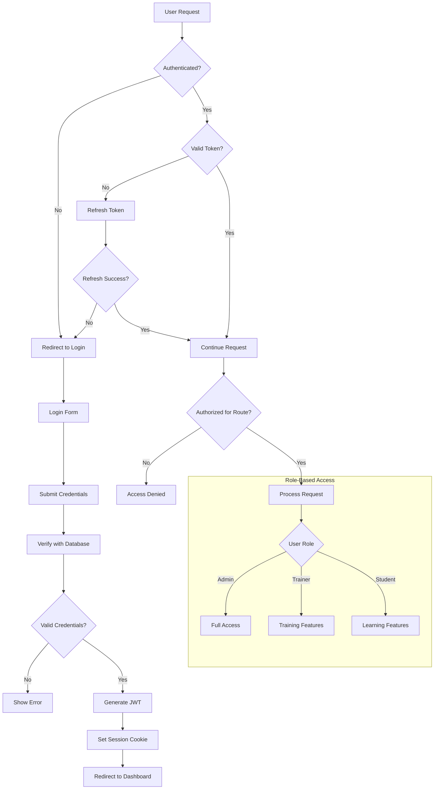

# Tunalismus Project - Complete Workflow Charts

## 🏗️ System Architecture Overview



## 👨‍💼 Admin Workflow



## 👨‍🏫 Trainer Workflow



```mermaid
flowchart TD
    A[Trainer Login] --> B[Trainer Dashboard]
    B --> C[My Batches]
    B --> D[Student Management]
    B --> E[Session Management]
    B --> F[Material Management]
    B --> G[Schedule Management]
    B --> H[Progress Tracking]
    
    C --> C1[View Assigned Batches]
    C --> C2[Batch Details]
    C --> C3[Student List in Batch]
    C --> C4[Batch Performance]
    
    D --> D1[View My Students]
    D --> D2[Student Progress]
    D --> D3[Individual Assessments]
    D --> D4[Communication]
    
    E --> E1[Create New Session]
    E --> E2[Schedule Sessions]
    E --> E3[Jitsi Meet Integration]
    E --> E4[Session Materials]
    
    F --> F1[Upload Materials]
    F --> F2[Organize by Course]
    F --> F3[Share with Students]
    F --> F4[Version Control]
    
    G --> G1[View Schedule]
    G --> G2[Create Schedule]
    G --> G3[Update Schedule]
    G --> G4[Conflict Resolution]
    
    H --> H1[Student Progress Reports]
    H --> H2[Attendance Tracking]
    H --> H3[Performance Analytics]
    H --> H4[Grade Management]
```

## 🎓 Student Workflow

```mermaid
flowchart TD
    A[Student Login] --> B[Student Dashboard]
    B --> C[My Courses]
    B --> D[Course Enrollment]
    B --> E[Learning Materials]
    B --> F[Schedule View]
    B --> G[Progress Tracking]
    B --> H[Payment Management]
    
    C --> C1[View Enrolled Courses]
    C --> C2[Course Details]
    C --> C3[Course Materials]
    C --> C4[Course Progress]
    
    D --> D1[Browse Available Courses]
    D --> D2[Course Information]
    D --> D3[Payment Process]
    D --> D4[Enrollment Confirmation]
    
    E --> E1[Download Materials]
    E --> E2[View Videos]
    E --> E3[Access Resources]
    E --> E4[Submit Assignments]
    
    F --> F1[View Class Schedule]
    F --> F2[Session Reminders]
    F --> F3[Join Live Sessions]
    F --> F4[Session Recordings]
    
    G --> G1[Track Learning Progress]
    G --> G2[View Grades]
    G --> G3[Assessment Results]
    G --> G4[Certificates]
    
    H --> H1[Payment History]
    H --> H2[Invoice Downloads]
    H --> H3[Payment Methods]
    H --> H4[Refund Requests]
```



## 🔄 Complete User Journey Flow



## 🗄️ Database Schema Relationships



## 🔐 Authentication & Authorization Flow



## 📊 API Endpoint Structure

```mermaid
graph TB
    subgraph "Admin APIs"
        A1[/api/admin/users] --> A1A[GET: List Users]
        A1 --> A1B[POST: Create User]
        A1 --> A1C[PUT: Update User]
        A1 --> A1D[DELETE: Delete User]
        
        A2[/api/admin/courses] --> A2A[GET: List Courses]
        A2 --> A2B[POST: Create Course]
        A2 --> A2C[PUT: Update Course]
        
        A3[/api/admin/batches] --> A3A[GET: List Batches]
        A3 --> A3B[POST: Create Batch]
        A3 --> A3C[PUT: Update Batch]
        
        A4[/api/admin/payments] --> A4A[GET: Payment History]
        A4 --> A4B[POST: Process Refund]
        
        A5[/api/admin/stats] --> A5A[GET: System Statistics]
    end
    
    subgraph "Trainer APIs"
        T1[/api/trainer/batches] --> T1A[GET: My Batches]
        T1 --> T1B[POST: Create Session]
        
        T2[/api/trainer/students] --> T2A[GET: My Students]
        T2 --> T2B[POST: Update Progress]
        
        T3[/api/trainer/materials] --> T3A[GET: Course Materials]
        T3 --> T3B[POST: Upload Material]
        
        T4[/api/trainer/sessions] --> T4A[GET: Session Schedule]
        T4 --> T4B[POST: Create Session]
        
        T5[/api/trainer/stats] --> T5A[GET: Performance Stats]
    end
    
    subgraph "Student APIs"
        S1[/api/student/courses] --> S1A[GET: My Courses]
        S1 --> S1B[POST: Enroll Course]
        
        S2[/api/student/materials] --> S2A[GET: Course Materials]
        S2 --> S2B[GET: Download Material]
        
        S3[/api/student/schedule] --> S3A[GET: My Schedule]
        
        S4[/api/student/progress] --> S4A[GET: My Progress]
        S4 --> S4B[POST: Update Progress]
        
        S5[/api/student/stats] --> S5A[GET: Learning Stats]
    end
    
    subgraph "Shared APIs"
        SH1[/api/auth/login] --> SH1A[POST: User Login]
        SH1 --> SH1B[POST: User Logout]
        
        SH2[/api/payments/order] --> SH2A[POST: Create Order]
        SH2 --> SH2B[POST: Verify Payment]
        
        SH3[/api/courses] --> SH3A[GET: Public Courses]
        SH3 --> SH3B[GET: Course Details]
    end
```

## 🎯 Key Features & Integrations

### Payment Integration (Razorpay)
- Course enrollment payments
- Batch booking payments
- Refund processing
- Payment history tracking

### Video Conferencing (Jitsi Meet)
- Live training sessions
- Student-trainer interactions
- Session recordings
- Screen sharing capabilities

### Email Services
- User registration confirmations
- Course enrollment notifications
- Session reminders
- Password reset emails

### File Management
- Course material uploads
- Student assignment submissions
- Document versioning
- Secure file access

## 📈 Performance Monitoring Points

1. **Database Queries**: Monitor MongoDB query performance
2. **API Response Times**: Track endpoint response times
3. **Authentication Flow**: Monitor login/logout performance
4. **File Upload/Download**: Track material transfer speeds
5. **Video Streaming**: Monitor Jitsi Meet performance
6. **Payment Processing**: Track Razorpay transaction times

## 🔧 Testing Strategy Recommendations

### Unit Tests
- Component rendering tests
- API endpoint tests
- Database model tests
- Utility function tests

### Integration Tests
- Authentication flow tests
- Payment processing tests
- File upload/download tests
- Email service tests

### End-to-End Tests
- Complete user registration flow
- Course enrollment process
- Live session participation
- Payment and refund flows

### Performance Tests
- Database query optimization
- API response time tests
- File transfer speed tests
- Concurrent user load tests
